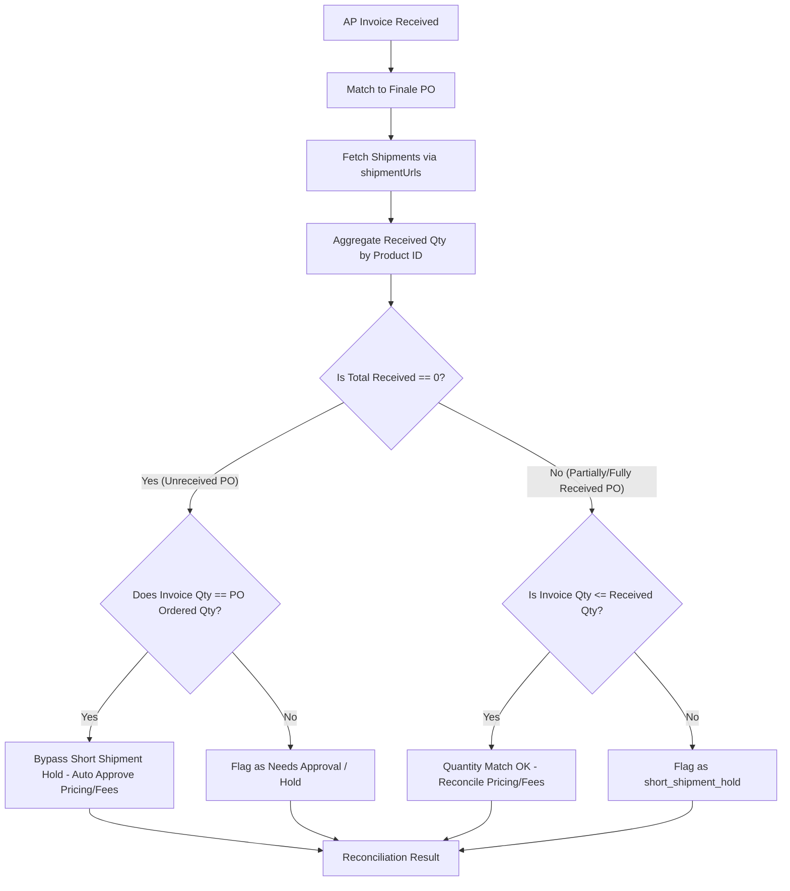

# Design Document - Three-Way Matching (Invoice × PO × Receiving) with Unreceived Bypass

**Date:** 2026-05-20
**Owner:** Will @ BuildASoil
**Status:** Approved / Designing
**Topic:** Reconciling physical warehouse received quantities from Finale against AP invoices and committed POs.

---

## 1. Context & Purpose

The Aria AP pipeline successfully correlates **Invoices ↔ POs** by unit prices, line item matches, and fee allocations (freight, tax, etc.). However, it has a blind spot regarding actual physical deliveries at the warehouse:
- **The Gap:** A vendor may bill for 10 units, the PO may expect 10 units, but the warehouse only receives 8 units due to a short-shipment. In this scenario, the invoice is currently auto-approved, creating a cash leakage of 2 units.
- **The Timing Dilemma ("Unreceived POs"):** Invoices frequently arrive *before* the physical delivery has arrived or been counted at the warehouse. If a strict `billedQty <= receivedQty` rule is enforced, every invoice arriving early would trigger a block/hold because `receivedQty = 0`.
- **The Solution:** A timing-aware 3-way matching algorithm.
  1. **PO is Unreceived (`totalReceived === 0`):** Compare the invoice line quantities against the PO ordered quantities. If they match perfectly, we bypass the short-shipment block (the "invoice RCV on purchase prior to receiving" bypass) and let the normal pricing/fee guards run.
  2. **PO is Partially or Fully Received (`totalReceived > 0`):** Enforce strict 3-way matching. If `invoiceQty > receivedQty`, flag a `short_shipment_hold` and capture the exact receiving gap to alert humans for credit-memo recovery.

---

## 2. Technical Architecture & Data Flow



### 2.1 Database Updates
We utilize the existing Supabase migrations which provide:
- `short_shipment_detected` (BOOLEAN)
- `short_shipment_lines` (TEXT[])
- `receiving_gap_total` (NUMERIC)
- `receiving_status` (JSONB)

These columns are updated whenever a reconciliation result returns a `"short_shipment_hold"` verdict, and stored in `ap_activity_log`.

---

## 3. Detailed Component Modifications

### 3.1 `src/lib/finale/client.ts`
- Export `getShipmentReceiptItems(shipment)` to allow `reconciler.ts` to extract products and quantities from the shipment payload.
- We will verify that `getShipmentReceiptDateTime` and `getShipmentReceiverName` are already exported.

### 3.2 `src/lib/finale/reconciler.ts`
- Add `"short_shipment_hold"` to the `ReconciliationVerdict` union type.
- Update `PriceChange` interface to hold physical receiving context:
  ```typescript
  export interface PriceChange {
      productId: string;
      description: string;
      poPrice: number;
      invoicePrice: number;
      quantity: number;
      percentChange: number;
      dollarImpact: number;
      verdict: ReconciliationVerdict;
      reason: string;
      receivedQty?: number;
      receivingGap?: number;
  }
  ```
- Modify `reconcileInvoiceToPO` to fetch shipment details:
  ```typescript
  const shipmentDetails = await Promise.all(
      (poSummary.shipmentUrls || []).map((url) => client.getShipmentDetails(url))
  );
  ```
- Sum the received quantities across all shipments by `productId`, and keep track of `totalReceived`.
- Pass these details to `reconcileLineItems(invoice, po, receivedQtyMap, totalReceived)`.
- Update line items comparison:
  - If `totalReceived === 0` and `invoiceQty === poQty`, let price/fee guards determine the verdict (bypass quantity block).
  - If `totalReceived === 0` and `invoiceQty !== poQty`, set verdict to `needs_approval` or `short_shipment_hold` with details.
  - If `totalReceived > 0` and `invoiceQty > receivedQty`, set line verdict to `short_shipment_hold`.
  - Set `receivedQty` and `receivingGap` on the returned `PriceChange` object.
- Aggregate overall verdict to `"short_shipment_hold"` if any line has `short_shipment_hold`.

### 3.3 `src/lib/intelligence/ap-agent.ts`
- Handle `"short_shipment_hold"` verdict branch inside `reconcileAndUpdate`:
  - Enqueue for dashboard review using `enqueueForDashboardReview`.
  - Update `ap_activity_log` with `short_shipment_detected = true`, `short_shipment_lines`, and `receiving_gap_total`.
  - Send an interactive and clear Telegram notification.
  - Record the AP Handoff and block the AP issue in the ledger.

---

## 4. Telegram Notification Design

When a short shipment is detected, Will receives the following premium Telegram alert:

```markdown
⚠️ *Short Shipment Detected — Reconcile with credit memo or warehouse*

PO: `PO-10492`
Vendor: Faust Bio-Agricultural Services, Inc.
Invoice: #INV-492910

Discrepancies:
  • SKU-A (Mycorise): Invoiced 100 units, but warehouse only received 80.
    Gap: 20 units ($500.00 impact).
  • SKU-B (Humic Acid): Invoiced 50 units, but warehouse received 0.
    Gap: 50 units ($1,250.00 impact).

Total Gap: 70 units
Dollar Impact Held: $1,750.00

Held in dashboard AP/Invoices panel for credit memo or manual override.
```

---

## 5. Verification Plan

### 5.1 Automated Unit Tests
We will write three robust unit tests in `src/lib/finale/reconciler.test.ts` covering:
1. **Timing Bypass (Unreceived PO):** Invoice quantity matches PO quantity, `totalReceived = 0`. Verdict is `auto_approve`.
2. **Timing Mismatch (Unreceived PO):** Invoice quantity does NOT match PO quantity, `totalReceived = 0`. Verdict is `needs_approval`.
3. **Short Shipment (Received PO):** Physical receiving has commenced (`totalReceived > 0`), and invoice quantity exceeds received quantity. Verdict is `short_shipment_hold`.

We will run the Vitest suite and verify that all tests pass cleanly.
